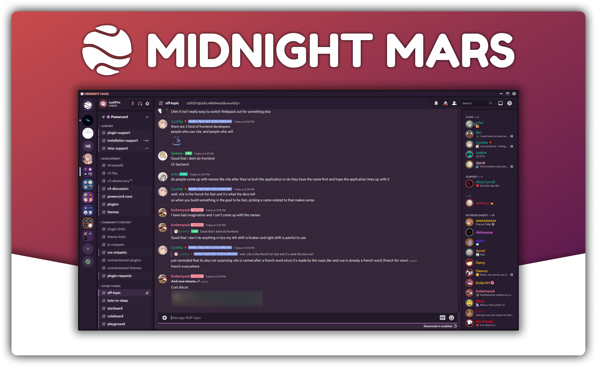

# Midnight Mars
A simple, nice looking and deep purple theme inspired by **midnight** on **Mars**!



## Installation
For Powercord & Vizality installation, go to **Themes -> Open CMD / Powershell / Terminal / Gitbash**, and enter the following:
```
git clone https://github.com/LuckFire/midnight-mars
```

**For BetterDiscord:**
- [Direct Download](https://betterdiscord.net/ghdl?id=3637)
- [View Source](https://luckfire.github.io/midnight-mars/src/support/_compiled.css)

**For Browser / Web:**
1. Install the Stylus extension for [Chrome](https://chrome.google.com/webstore/detail/stylus/clngdbkpkpeebahjckkjfobafhncgmne) / [Firefox](https://addons.mozilla.org/en-US/firefox/addon/styl-us/) / [Opera](https://github.com/openstyles/stylus/wiki/Opera,-Outdated-Stylus).
2. After installing, head over to [this link](https://luckfire.github.io/midnight-mars/src/support/MidnightMars.user.css).
3. Press the "Install Style" button.

# Credits
A big thank you to everyone for the inspiration and help with making this theme!
- **[Pavui](https://github.com/Pavui/)** for helping me stay sane and be a huge inspiration and help on getting this theme done.
- **[kingultron99](https://github.com/kingultron99)** for the idea of a reactive chat input, coming from their [Material](https://github.com/Kings-Discord-Stuff/material/) theme.
- **[Fahrenheit](https://github.com/Fahrenheit)** for giving me the idea that separates the members list <3

Addon Credits:
- **[Tropical](https://github.com/Tropix126)** for [usrbg](https://github.com/Discord-Custom-Covers/usrbg).
- **[Gibbu](https://github.com/gibbu)** for [RadialStatus](https://github.com/DiscordStyles/RadialStatus).
- **[NYRI4](https://github.com/NYRI4)** for [Disccolored](https://github.com/NYRI4/Discolored) .